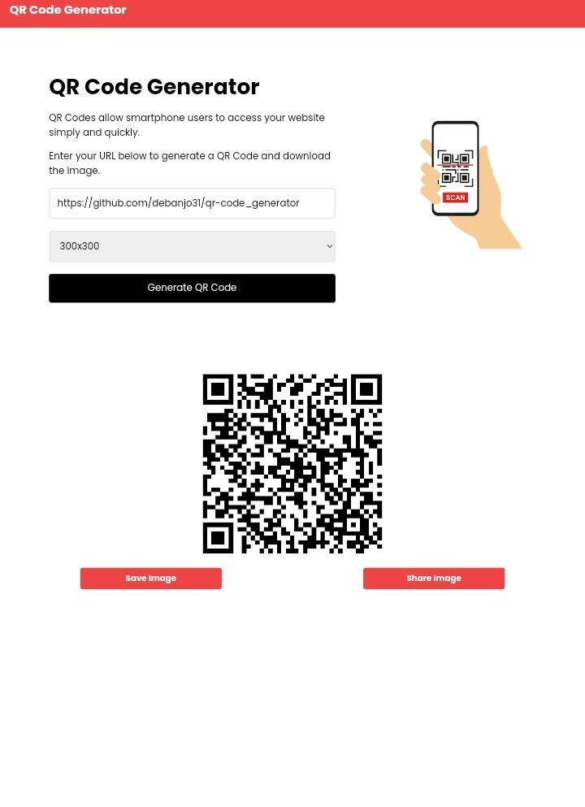

# QR Code Generator

Simple app to generate and download a QR code that can be used to share a link.

[Live Demo](https://qrbarcode-generator.netlify.app)

### MIT License

Copyright &copy; 2022 Adebanjo Israel

Thisw is a simple front-end app that converts url to Qr Bar Code which can be saved into a png Image file or shared directly from the browser.

Vanilla JS, Tailwind CSS, Google Icos, QR Code Generator CDN (tweaked to make it function on Mobile devices).
